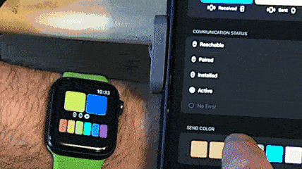

<p align="center">
    
</p>
<h1 align="center"> SundialKit </h1>

Communications library across Apple platforms.

[](https://swift.org)
[](http://twitter.com/brightdigit)


[](https://swiftpackageindex.com/brightdigit/SundialKit)
[](https://swiftpackageindex.com/brightdigit/SundialKit)


[](https://codecov.io/gh/brightdigit/SundialKit)
[](https://www.codefactor.io/repository/github/brightdigit/SundialKit)
[](https://codebeat.co/projects/github-com-brightdigit-SundialKit-main)
[](https://codeclimate.com/github/brightdigit/SundialKit)
[](https://codeclimate.com/github/brightdigit/SundialKit)
[](https://codeclimate.com/github/brightdigit/SundialKit)
[](https://houndci.com)





# Table of Contents

   * [**Introduction**](#introduction)
   * [**Features**](#features)
   * [**Installation**](#installation)
   * [**Usage**](#usage)
      * [Network Availability](#fetching-records-using-a-query-recordsquery)
      * [Watch Connectivity](#fetching-records-by-record-name-recordslookup)
      * [Examples](#examples)
      * [Further Code Documentation](#further-code-documentation)
   * [**Roadmap**](#roadmap)
      * [~~0.1.0~~](#010)
      * [~~0.2.0~~](#020)
      * [**0.4.0**](#040)
      * [0.6.0](#060)
      * [0.8.0](#080)
      * [0.9.0](#090)
      * [v1.0.0](#v100)
   * [**License**](#license)

# Introduction

_what does this do_
_why should you use_


### Demo Example

#### Sundial App


# Features 

Here's what's currently implemented with this library:

- [x] Composing Web Service Requests
- [x] Modifying Records (records/modify)
- [x] Fetching Records Using a Query (records/query)
- [x] Fetching Records by Record Name (records/lookup)
- [x] Fetching Current User Identity (users/caller)

# Installation

Swift Package Manager is Apple's decentralized dependency manager to integrate libraries to your Swift projects. It is now fully integrated with Xcode 11.

To integrate **SundialKit** into your project using SPM, specify it in your Package.swift file:

```swift    
let package = Package(
  ...
  dependencies: [
    .package(url: "https://github.com/brightdigit/SundialKit.git", from: "0.2.0")
  ],
  targets: [
      .target(
          name: "YourTarget",
          dependencies: ["SundialKit", ...]),
      ...
  ]
)
```

# Usage 

## Composing Web Service Requests

## Further Code Documentation

[Documentation Here](/Documentation/Reference/README.md)

# Roadmap

<!-- https://developer.apple.com/library/archive/documentation/DataManagement/Conceptual/CloudKitWebServicesReference/index.html#//apple_ref/doc/uid/TP40015240-CH41-SW1 -->

## 0.1.0

- [x] Composing Web Service Requests
- [x] Modifying Records (records/modify)
- [x] Fetching Records Using a Query (records/query)
- [x] Fetching Records by Record Name (records/lookup)
- [x] Fetching Current User Identity (users/caller)

## 0.2.0 

- [x] Vapor Token Client
- [x] Vapor Token Storage
- [x] Vapor URL Client
- [x] Swift NIO URL Client
